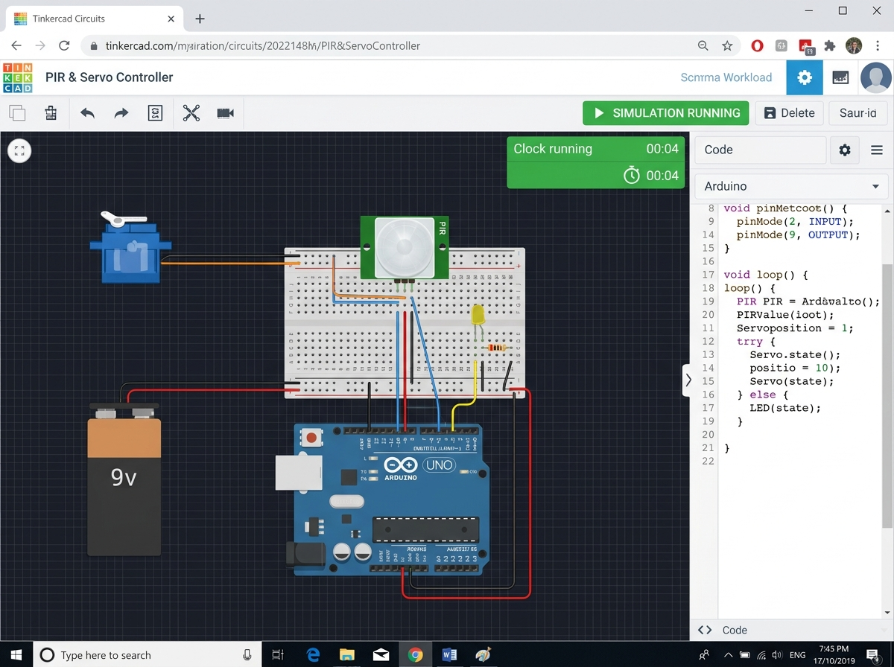

# Task 3: IoT Prototype - Smart Home Automation

An IoT Smart Home Automation prototype using an Arduino Uno, a PIR motion sensor, a servo motor (acting as an automated door lock), a 9V external battery power supply, and an LED representing the home lighting circuit.

## Simulation Interface (Tinkercad)

## Connections
- **Power Supply**: External **9V battery** connected to the breadboard power rail to run the Servo motor and PIR sensor safely.
- **PIR Sensor**: Signal pin connected to Arduino Digital Pin **2**.
- **Servo Motor**: PWM signal pin connected to Arduino Digital Pin **9**.
- **LED (Lights)**: Connected to Arduino Digital Pin **8** via a 220Ω current-limiting resistor.

## How to Run
1. Open [Tinkercad Circuits](https://www.tinkercad.com/).
2. Assemble the components using the circuit schematic as shown in the screenshot.
3. Paste the code from `home_automation.ino` into the code editor.
4. Click **Start Simulation** to run the home automation system.
