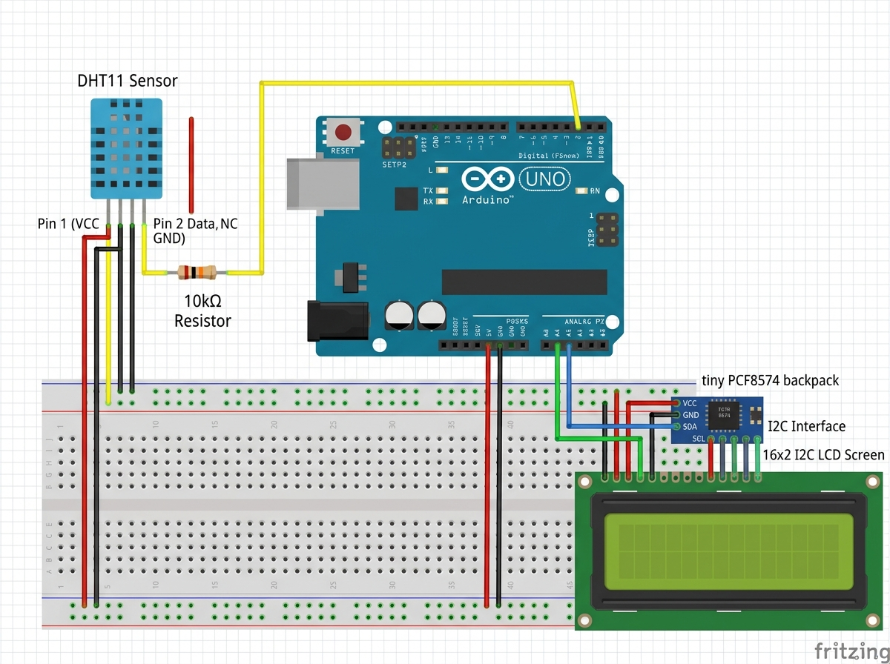

# Task 3: IoT Prototype - Temperature & Humidity Monitor

An IoT Weather Station prototype using an Arduino Uno, a DHT11 sensor for tracking ambient temperature and relative humidity, and a 16x2 I2C LCD display for visualizing the readings.

## Circuit Diagram

## Connections
- **DHT11**: Connected to VCC, GND, and Digital Pin **2**.
- **16x2 I2C LCD**: SDA pin -> Arduino **A4**, SCL pin -> Arduino **A5**, VCC -> 5V, GND -> GND.

## Libraries Required
- `DHT sensor library` (Adafruit)
- `LiquidCrystal_I2C`

## How to Run
1. Wire the physical circuit or simulation according to the diagram.
2. Install the necessary libraries in the Arduino IDE.
3. Open `dht11_lcd_monitor.ino` and upload it to your Arduino Uno board.
4. Open the Serial Monitor at `9600` baud or observe the 16x2 LCD display to see real-time environment data.
